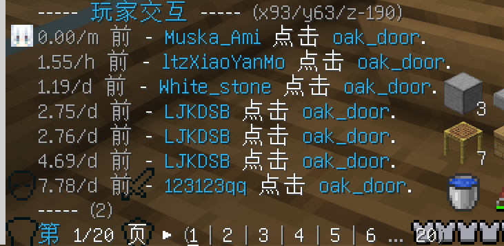
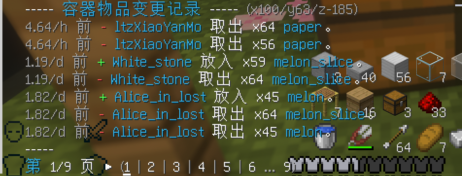
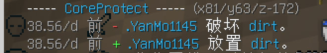

# 世界变动检索

这里发生了了什么，就让我这个侦探告诉你吧。

## 命令列表

| 命令          | 说明            | 别名    |
|-------------|---------------|-------|
| /co inspect | 打开/关闭世界变动检索工具 | /co i |

## 功能说明

启用该工具后，即可检索指定位置的方块变动情况。

对一个位置的方块右键（对应基岩版使用）即可查询该位置变化情况。

