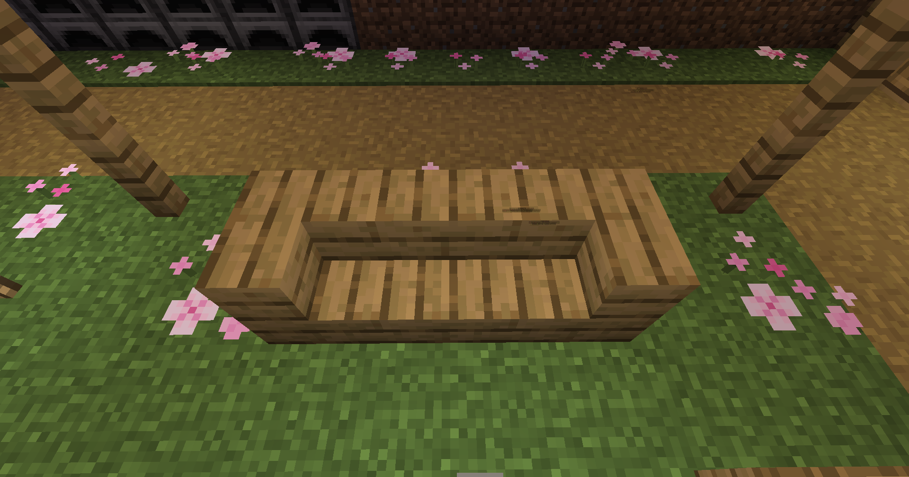

# 椅子

坐下！

## 命令列表

| 命令          | 说明     |
|-------------|--------|
| /chairs on  | 启用椅子功能 |
| /chairs off | 禁用椅子功能 |

## 功能说明

空手右键一个合法的椅子即可坐下。
以下是合法的椅子类型：

- 告示牌+楼梯
  
- 楼梯
- 

楼梯的长度是没有限制的，任何符合模板的椅子都是合法的。
