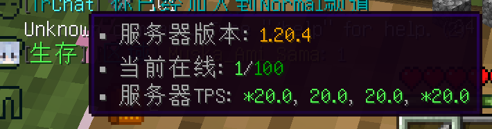
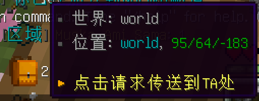
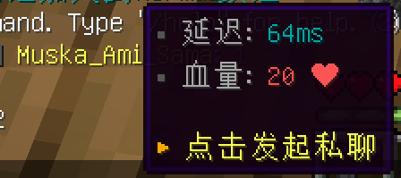
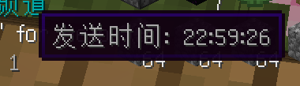

# 聊天功能

## 命令列表

| 命令      | 说明     | 别名 |
|---------|--------|----|
| /tell   | 私聊一名玩家 | /w |
| /reply  | 回复私聊信息 | /r |
| /global | 全服喊话   |    |

### 全服喊话

聊天消息前添加 `!!` ，消息将被广播至全服务器。
`/global` 命令效果一致。

### 提及

聊天消息添加 @玩家名 即可提及。被提及的玩家将会被声音提示。

### 快捷操作

!!! note

    此特性为 《Minecraft: Java版》 独有。

鼠标悬浮 `玩家位置` 即可显示玩家所在服务器信息。

鼠标悬浮 `玩家所在频道` 即可显示玩家当前位于该频道的世界信息。点击可快速发起向该玩家的传送请求。

鼠标悬浮 `玩家名` 即可查看玩家当前信息。点击可快速发起向该玩家私聊。

鼠标悬浮 `消息` 即可查看发送时间。

### 物品展示

!!! note

    此特性为 《Minecraft: Java版》 独有。  
    尽管基岩版玩家也可以发出，但无法查看具体信息。

消息内输入对应占位符即可自动转换。

#### 手持物品

占位符列表：

- %i
- \[i]
- \[item]

#### 背包

占位符列表：

- \[inv]
- \[inventory]

#### 末影箱

- \[ender]
- \[enderchest]
