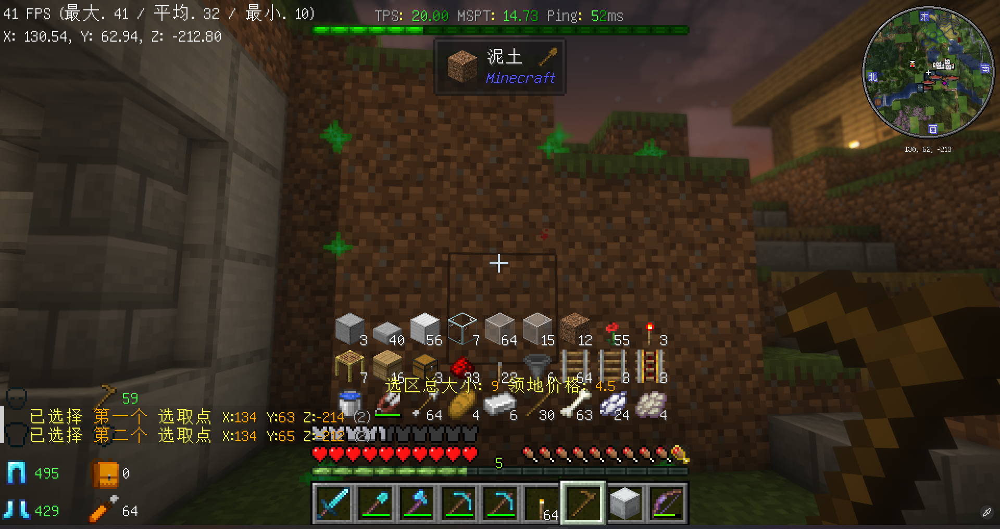

!!! info

    该功能仅生存服可用。

!!! warning

    请勿恶意圈地，如遇到恶意圈地，请联系服务器管理员，我们会协助您解除圈地保护，并对恶意圈地者进行处罚。

# 领地

保护区域不被他人操作。

## 命令列表

| 命令          | 说明            |
|-------------|---------------|
| /res create | 创建一个领地        |
| /res set    | 修改领地设置        |
| /res expand | 向对应方向扩展领地     |
| /res padd   | 快速为一个玩家添加领地权限 |

## 操作物品

- 木锄头

## 功能说明

### 创建领地

使用木锄头左键（对应基岩版挖掘）一个方块设置第一选取点，右键（对应基岩版点击）一个方块设置第二选取点。选取完成后，会提示选区信息并提供所需的费用。

此时执行命令 `/res create <名称>` 完成领地的创建。

### 扩展领地

在领地内看向需要扩展的方向，执行命令 `/res expand <要扩展的格数>` 向该方向扩展领地。

### 为指定玩家快速添加领地权限

执行命令 `/res padd <玩家名>` 快速为玩家添加领地权限。  
这些权限包括：

- container
- move
- harvest
- shear
- use
- destroy
- animalkilling
- beacon
- mobkilling
- build
- chat
- tp
- leash
