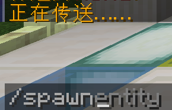

# 使用 Minecraft:JavaEdition

### 先决条件

要加入服务器，需要以下先决条件：

Minecraft:JavaEdition(版本1.18.2以上)

### 加入

打开Minecraft:JavaEdition（版本1.18.2以上）

点击**“多人游戏”**

点击**“添加服务器”**

在**“服务器地址”**中输入服务器地址（可在服务器QQ群中获取）

点击**“完成”**

右键双击服务器 或 在服务器Logo悬浮并右键单击

